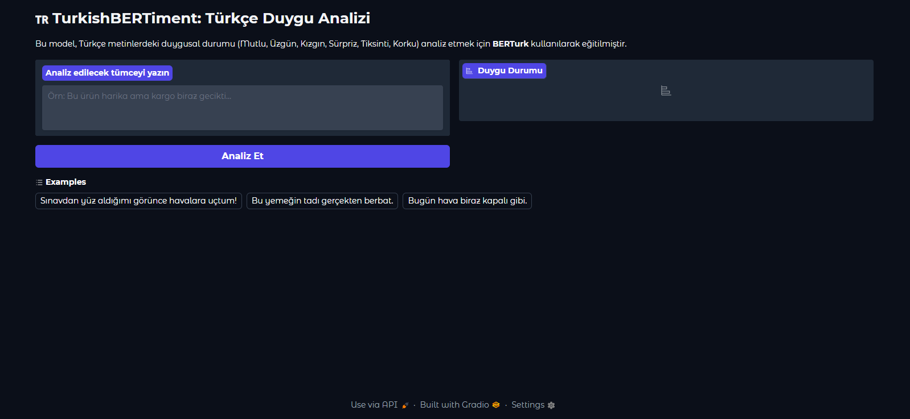

# 🇹🇷 TurkishBERTiment: Turkish Emotion Analysis with BERT

This project is a fine-tuned sentiment analysis model based on **BERTurk** (dbmdz/bert-base-turkish-cased). It classifies Turkish text into 5 distinct emotional categories.

## 🎯 Features
- **Model:** Fine-tuned BERT architecture specifically for the Turkish language.
- **Emotions:** Classifies text into: `Mutlu` (Happy), `Üzgün` (Sad), `Kızgın` (Angry), `Sürpriz` (Surprise), and `Tiksinti` (Disgust).
- **Interface:** User-friendly web interface powered by **Gradio**.
- **Accuracy:** Achieved high confidence scores (95%+) on validation sets.

## 📸 Demo


## 🛠️ Installation

1. Clone the repository:
   ```bash
   git clone [https://github.com/ardacey06/TurkishBERTiment.git](https://github.com/ardacey06/ceybert)
   cd TurkishBERTiment