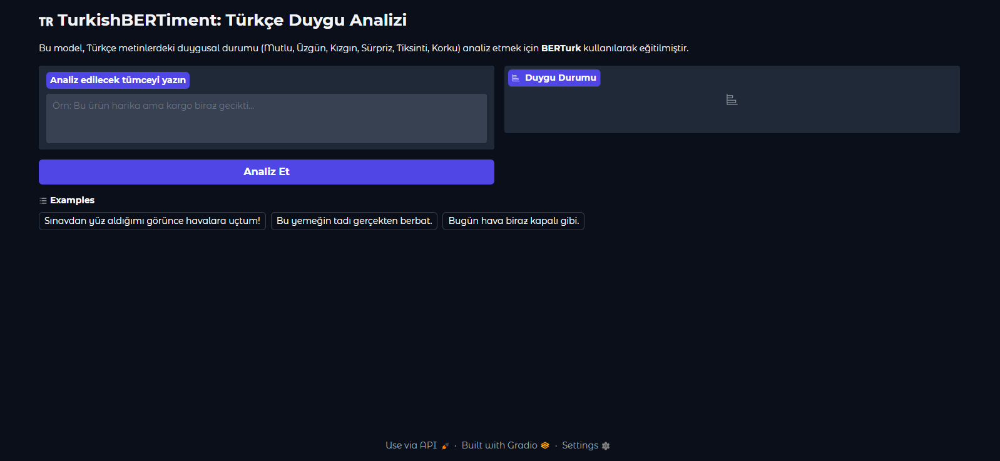

# 🇹🇷 Ceybert: Turkish Emotion Analysis with BERT

This project is a fine-tuned sentiment analysis model based on [BERTurk](https://github.com/dbmdz/berts) (dbmdz/bert-base-turkish-cased). It classifies Turkish text into 5 distinct emotional categories. 

**🚀 Try Demo:** [](https://huggingface.co/spaces/ardacey06/ceybert)
## 🎯 Features
- **Model:** Fine-tuned BERT architecture specifically for the Turkish language.
- **Emotions:** Classifies text into: `Mutlu` (Happy), `Üzgün` (Sad), `Kızgın` (Angry), `Sürpriz` (Surprise), and `Tiksinti` (Disgust).
- **Interface:** User-friendly web interface powered by **Gradio**.
- **Accuracy:** Achieved high confidence scores (85%+) on validation sets.

## 📸 Demo


## 🛠️ Installation

1. **Clone the repository:**
   ```bash
   git clone [https://github.com/ardacey06/ceybert.git](https://github.com/ardacey06/ceybert.git)
   cd ceybert

2. **Create a virtual environment (Recommended):**
```bash
python -m venv venv
```
For Windows:
venv\Scripts\activate
For macOS/Linux:
source venv/bin/activate

3. **Install dependencies:**
```bash
pip install -r requirements.txt
```

## 💻 Usage
To run the app locally:
   ```bash
   python ceybert.py
   ```
> Once the script starts, the interface will be available at `http://127.0.0.1:7860` in your web browser.
